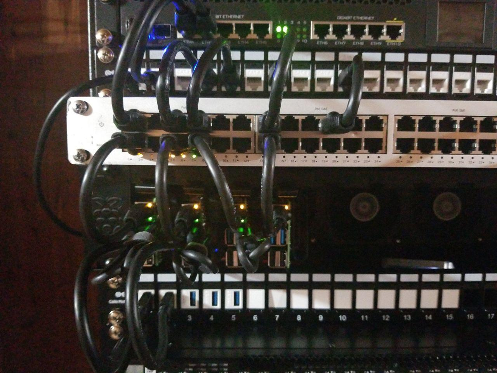

# k: home cluster

This cluster is based on the [talos](https://talos.dev) operating system.
Machine config can be generated (into the `./dist` directory) from the [`talos.yaml.jinja`](./talos.yaml.jinja) template with the [`talos.py`](./scripts/talos.py) script. 

    ./scripts/talos.py

> **NOTE**: Secrets are stored in [vaultwarden](https://github.com/dani-garcia/vaultwarden).
Unlock a session in your current shell with
>
>      BW_SESSION=$(bw unlock --raw)
>

Follow the upstream [installation process](https://www.talos.dev/docs/v0.13/single-board-computers/rpi_4/) to install the OS then use the generated config to bootstrap each node.

Once the cluster is up, grab the talosconfig from vaultwarden

    bw get item talosconfig | jq -r '.notes' > ~/.talos/config
    
 Then use the talosctl CLI to get a kubeconfig file:

    talosctl kubeconfig

Workloads are managed with [helmfile](https://github.com/roboll/helmfile); use

    helmfile apply

to deploy everything or

    helmfile -i -l name=<release> apply --wait

for a single release with a confirmation diff before changes are made.

## architecture

As of now, all nodes are a Raspberry Pi 4, 8Gb RAM with a 1TB Samsung T5 attached.

<!-- START TABLE -->
| hostname | arch  | os              |  cpu | memory | storage |
| :------- | :---- | :-------------- | ---: | :----- | :------ |
| k0       | arm64 | Talos (v0.12.1) |    4 | 7.65Gi | 29.22Gi |
| k1       | arm64 | Talos (v0.12.1) |    4 | 7.65Gi | 29.22Gi |
| k2       | arm64 | Talos (v0.12.1) |    4 | 7.65Gi | 29.22Gi |
| k3       | arm64 | Talos (v0.12.1) |    4 | 7.65Gi | 29.22Gi |
<!-- END TABLE -->

Generated from [`table.py`](./scripts/table.py).

## config

Of course, some extra config is necessary as this cluster doesn't (yet?) constitute the entire home network.
See the [`./devices`](./devices) directory for the configuration and setup of devices outside of the cluster.

## import

Some things that need automated either by bringing them into the cluster or creating declarative, reproducible builds.

  - gateway interfaces (netctl?)
  - connection sharing
  - DNS
  - DHCP
  - firewall (shorewall, nftables, firewalld)
  - traffic shaping
  - wap (hostapd)
  - caching web proxy?
  - ntp?
