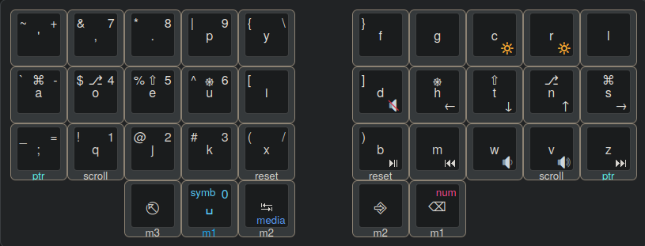
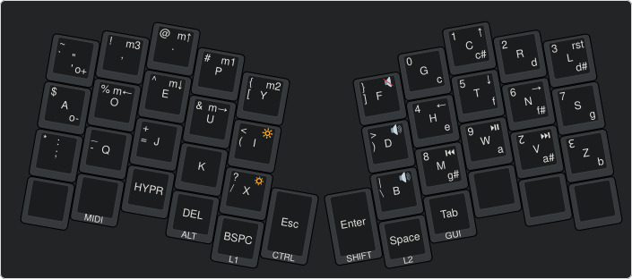

# keyboards

[Install qmk](https://docs.qmk.fm/#/cli?id=install-using-easy_install-or-pip) and flash with:

    make [keyboard]

## charybdis

http://www.keyboard-layout-editor.com/#/gists/64afeb99f472a1978140238d9558e46b

## atreus

http://www.keyboard-layout-editor.com/#/gists/4d49ea2f4c639831c6efe5553cdab5d4

